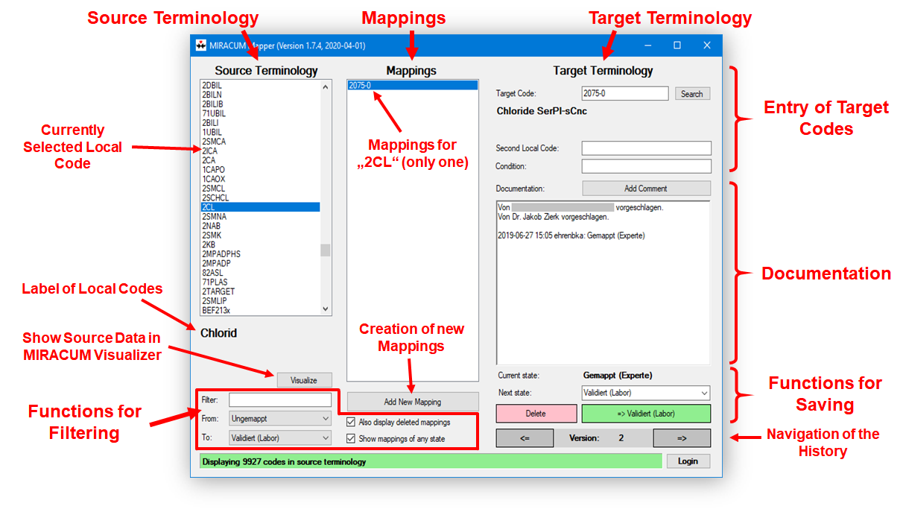
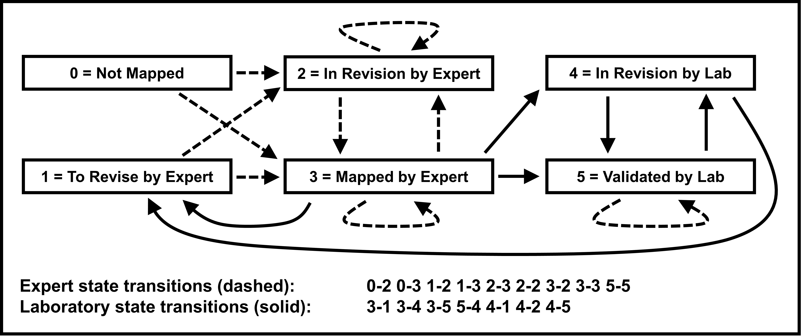

# MIRACUM Mapper

**Note:** A new version is currently under development and can be found here: https://github.com/miracum/MIRACUM-Mapper-2.0-backend

MIRACUM Mapper is a multi-user application for collaboratively creating mappings to medical terminologies, such as LOINC.

The manual mapping of local codes to standard terminologies specific to an organization or institute can be a tedious task. Aligning such codes requires not only fundamental terminological knowledge but also a good understanding of the local context, necessitating constant information exchange with colleagues. Manually maintaining code lists in spreadsheets (e.g., Excel) and communication via email or phone is not particularly efficient. This leads to both a potential "data chaos" and the challenge of colleagues not always being available.

The tool MIRACUM Mapper has been developed to simplify and expedite the mapping process. The tool has already proven its effectiveness at Uniklinikum Erlangen, where around 10,000 laboratory codes had been mapped to the LOINC standard. A conference paper and an associated PowerPoint presentation (which is actually a self-playing video) can be found in the "publication" directory.

The tool is a small Windows application that runs locally on a Windows PC. It connects to central PostgreSQL database, where it stores user authentication data and the mappings.

*MIRACUM Mapper GUI*

## Key Features

- **Generic Mapping Tool:** Not limited to a specific standard terminology (e.g., LOINC).
- **Collaborative Mapping:** Asynchronous creation and editing of mappings with full multi-user support. Users can work on mappings at their convenience.
- **Customizable Workflow:** Fine-grained mapping workflow with customizable user roles and state transitions (see image below).
- **Versioning and Revision Security:** All edits are traceable recorded by the system.
- **LDAP Authentication:** Facilitates easy integration into Windows environments.
- **Implementation in C#:** Eases deployment in Windows environments.

## User Interface Features

- **Seamless Window Scaling:** Provides an ergonomic working experience over extended periods.
- **Multilingual Support:** Supports both German and English.
- **Integration Options:** Allows integration of visualization components (e.g., MIRACUM LabVisualizer) or terminology searches (e.g., for LOINC).

*MIRACUM Mapper State Machine*

## Getting the Code Running

- Open the source code in Visual Studio (VS) Community 2022 or a later version.
- If you encounter problems with the VS Form Designer in connection with the custom class TransparentPanel, see: https://stackoverflow.com/a/29247115.

## Configuration & Startup
### Config.dat File

When you run the program for the first time, it should not start as it still requires a correctly configured configuration file (Config.dat). This file stores the connection to the PostgreSQL database and the LDAP server. Note that the file is encrypted when it is processed by the program the first time, even if it has not yet been configured. It is a good idea to configure this file correctly in a binary distribution folder (which can be downloaded from the GitHub artifacts on the right) and instruct VS during development to also execute the temporary builds in this folder.

Since version 1.9.0: The configuration is now also saved in the database and retrieved by the program at startup. This makes it possible to automatically update the clients to a new configuration without manually distributing a "Config.dat" file. It is therefore necessary to also store the configuration in the database ("next_connection" table).

Since version 1.11.0: The program now saves updated database connections in the Windows registry instead of in the Config.dat file (it however tries to encrypt the file if it's not yet encrypted). It will always prefer the registry to the "Config.dat" file. To enable multiple MIRACUM Mapper instances/copies with different database connections, a "Project.dat" file storing a project identifier can be placed in the program directory, which is then used as the key to access the Windows registry. The keys are collected in "HKEY_CURRENT_USER\SOFTWARE\Miracum-Mapper". If there is no "Project.dat" file, the project is handled internally with the identifier "Default".

### Database Schema

This repository contains a sample database dump of a PostgreSQL schema (see "schema" directory) that can be used with MIRACUM Mapper. However, it does not yet include any medical terminology, such as LOINC. Contact the developer if you need assistance loading a terminology.

To support the new function with local passwords, you must update the supplied example schema according to the SQL file (also included in the "schema" directory).
